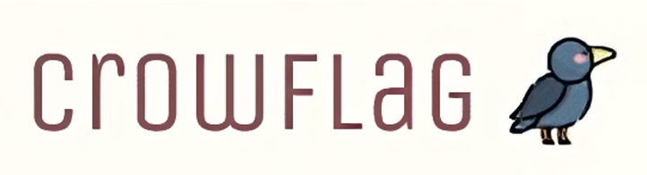

<br />
<div align="center">
  <a href="https://github.com/accalina/crowflag/">
    
  </a>

  <h3 align="center"><strong>CrowFlag</strong></h3>

  <p align="center">
    This script analyses the Nmap XML scanning results, parses each CPE context and correlates to search CVE on NIST. You can use that to find public vulnerabilities in services.
    <br />
    <br />
    <a href="https://github.dev/accalina/crowflag">View Code</a>
    ·
    <a href="https://github.com/accalina/crowflag/issues/new">Report Bug</a>
    ·
    <a href="https://github.com/accalina/crowflag/wiki">View Wiki</a>
  </p>
</div>


<br><br>

# <strong>Getting Started:</strong>
### Before we start
  - Tested using  **python 3.6.15** *(for manual installation)*
  - If any error raised related to library version not compatible, please remove the version lock on said library.
<br>

# <strong>Installation:</strong>

### <strong>Manual Installation</strong>
  - Clone this Repository
  - Create virtual env first using `$ python -m venv env`
  - Acitvated python virtual env with this command `$ source env/bin/activate`
  - Move to directory `crowflag`
  - Install dependency library with this command `pip install -r requirements.txt`
# <strong>Usage:</strong>
```
$ sudo nmap -sS -sV -O -P0 02:42:0A:00:00:03 -oX result.xml
$ python main.py result.xml

..::: CrowFlag :::..
10.0.0.2 [localhost aka: accalina-machine1]

port: 22
service: OpenSSH:8.4p1 Debian 5+deb11u1

   URL: https://nvd.nist.gov/vuln/detail/CVE-2021-41617
   Description: sshd in OpenSSH 6.2 through 8.x before 8.8, when certain non-default configurations are used, allows privilege escalation because supplemental groups are not initialized as expected. Helper programs for AuthorizedKeysCommand and AuthorizedPrincipalsCommand may run with privileges associated with group memberships of the sshd process, if the configuration specifies running the command as a different user.

   URL: https://nvd.nist.gov/vuln/detail/CVE-2021-36368
   Description: ** DISPUTED ** An issue was discovered in OpenSSH before 8.9. If a client is using public-key authentication with agent forwarding but without -oLogLevel=verbose, and an attacker has silently modified the server to support the None authentication option, then the user cannot determine whether FIDO authentication is going to confirm that the user wishes to connect to that server, or that the user wishes to allow that server to connect to a different server on the user's behalf. NOTE: the vendor's position is "this is not an authentication bypass, since nothing is being bypassed."

   URL: https://nvd.nist.gov/vuln/detail/CVE-2021-28041
   Description: ssh-agent in OpenSSH before 8.5 has a double free that may be relevant in a few less-common scenarios, such as unconstrained agent-socket access on a legacy operating system, or the forwarding of an agent to an attacker-controlled host.

   URL: https://nvd.nist.gov/vuln/detail/CVE-2016-20012
   Description: ** DISPUTED ** OpenSSH through 8.7 allows remote attackers, who have a suspicion that a certain combination of username and public key is known to an SSH server, to test whether this suspicion is correct. This occurs because a challenge is sent only when that combination could be valid for a login session. NOTE: the vendor does not recognize user enumeration as a vulnerability for this product.


port: 80
service: Caddy httpd


port: 443
service: Caddy httpd
```

# <strong>FAQ:</strong>

### <strong>How to write XML output on Nmap </strong>
https://nmap.org/book/output-formats-xml-output.html

### <strong>What is a CPE ? </strong>
https://nmap.org/book/output-formats-cpe.html
https://nvd.nist.gov/products/cpe

### <strong>How to write XML output on Nmap </strong>
https://cve.mitre.org/

### <strong>This is a true vulnerability scanner ? </strong>
Nope, this script is util to audit banners of services, this tool don't test inputs... Full Vulnerability scanner its complex, look that following http://www.openvas.org/

# <strong>Disclaimer:</strong>
The purpose of this tool is to use in pentest, take attention if you have a proper authorization before to use that. I do not have responsibility for your actions. You can use a hammer to construct a house or destroy it, choose the law path, don't be a bad guy, remember.

